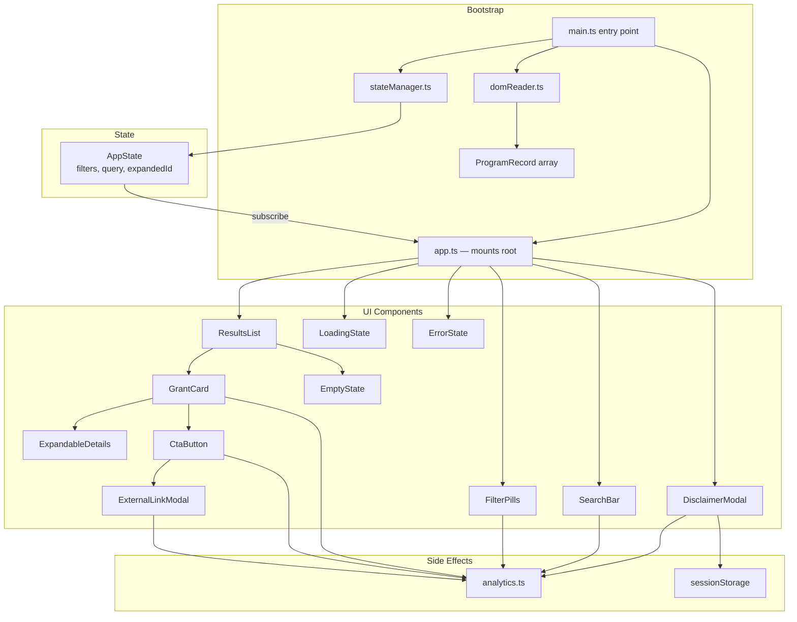
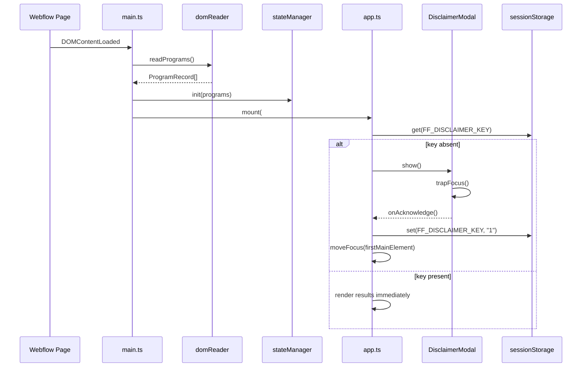
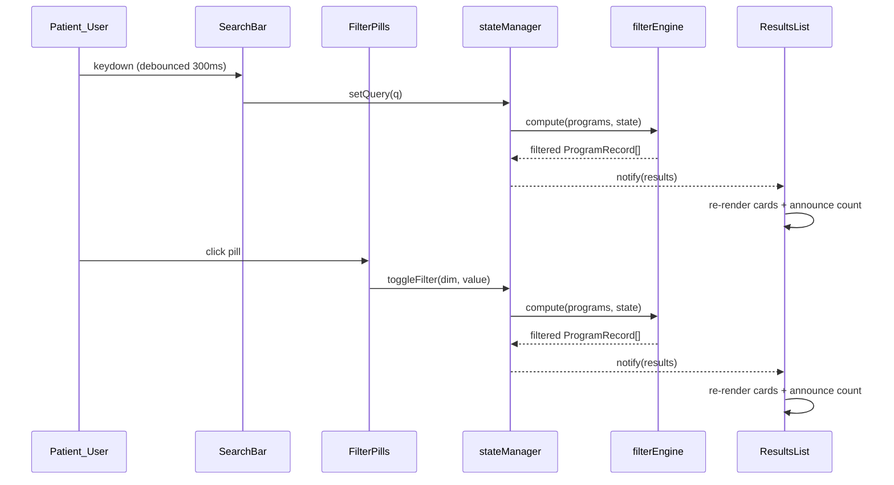
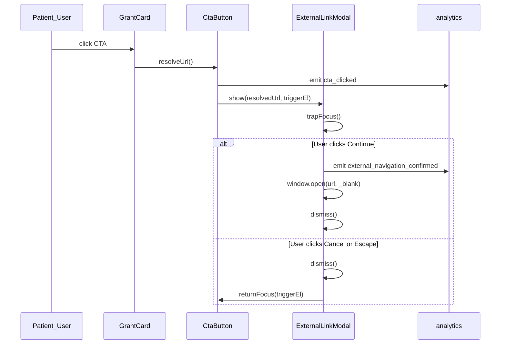

# Design Document: Foundation Finder Frontend

## Overview

The Foundation Finder is a zero-framework TypeScript + Vite widget that is compiled to a single JavaScript bundle and injected into a Webflow-hosted page via a `<script>` tag. On load the script reads Webflow's server-rendered CMS collection HTML once, builds a typed in-memory data array, hides the raw CMS markup, and takes over all rendering, filtering, searching, and interaction. The bundle is deployed to Cloudflare Pages via GitHub Actions; Webflow requires only a one-time `<script>` tag and a `<div id="foundation-finder-root">` mount point.

The design covers Phase 1 only (manual CMS + dynamic UI). Phase 2 (AI discovery workflow) is a separate backend concern and is out of scope for the frontend design.

---

## 1. High-Level Architecture

```
┌─────────────────────────────────────────────────────────────────┐
│                        WEBFLOW CDN                              │
│  ┌─────────────────────────────────────────────────────────┐   │
│  │  Webflow Page (axsome.com/foundation-finder)            │   │
│  │                                                          │   │
│  │  ① CMS Collection List (hidden after script loads)      │   │
│  │     [data-ff-program] elements with data-* attributes   │   │
│  │                                                          │   │
│  │  ② <div id="foundation-finder-root">                    │   │
│  │     └── (Foundation Finder mounts here)                 │   │
│  │                                                          │   │
│  │  ③ <script src="https://ff.pages.dev/main.js">         │   │
│  └─────────────────────────────────────────────────────────┘   │
└─────────────────────────────────────────────────────────────────┘
              │ loads
              ▼
┌─────────────────────────────────────────────────────────────────┐
│                   CLOUDFLARE PAGES                              │
│   main.js  (TypeScript → Vite bundle)                          │
│   main.css (bundled via Vite CSS injection)                     │
└─────────────────────────────────────────────────────────────────┘
              ▲ deploy
              │
┌─────────────────────────────────────────────────────────────────┐
│                    GITHUB ACTIONS CI/CD                         │
│   Push to main → npm ci → vite build → wrangler deploy         │
└─────────────────────────────────────────────────────────────────┘

Data flow at runtime:
  Webflow renders CMS → DOM contains program data
  Script reads DOM   → builds ProgramRecord[]
  Script hides DOM   → mounts Foundation Finder UI
  User interacts     → in-memory filter/search → re-render results
```


---

## 2. Architecture Diagram (Component View)




---

## 3. Main Sequence Diagrams

### 3.1 Page Load & Disclaimer Flow



### 3.2 Search + Filter Flow



### 3.3 CTA + External Link Flow




---

## 4. DOM Reading Strategy

Webflow renders the full CMS collection list into the page on the server side. The script reads this rendered HTML once at startup using data attributes that Webflow CMS binds automatically.

### 4.1 Required Webflow CMS Bindings

The Webflow designer must bind the following data attributes to the CMS Collection List item wrapper and its children. Each attribute value is a Webflow CMS field binding.

```
[data-ff-program]                     ← wrapper element (one per program)
  [data-ff-foundation-name]           ← Foundation Name (text)
  [data-ff-program-name]              ← Program Name (text)
  [data-ff-description]               ← Description (text, may be truncated)
  [data-ff-status]                    ← Status (Open|Closed|Not Yet Open|Government Program)
  [data-ff-last-updated]              ← Last Updated (ISO 8601 date string)
  [data-ff-disease-indications]       ← comma-separated indication names
  [data-ff-insurance-types]           ← comma-separated insurance type names
  [data-ff-grant-amount]              ← Grant Amount (numeric string, may be empty)
  [data-ff-apply-url]                 ← Apply Online URL (may be empty)
  [data-ff-program-url]               ← Program Website URL (may be empty)
  [data-ff-foundation-url]            ← Foundation Website URL (may be empty)
  [data-ff-contact-email]             ← Contact Email (may be empty)
  [data-ff-contact-phone]             ← Contact Phone (may be empty)
  [data-ff-metadata]                  ← JSON array: [{label:string,value:string}]
  [data-ff-program-id]                ← Webflow item slug or CMS ID (unique)
```

### 4.2 domReader.ts — Core Interface

```typescript
export interface MetadataField {
  label: string
  value: string
}

export type ProgramStatus =
  | 'Open'
  | 'Closed'
  | 'Not Yet Open'
  | 'Government Program'

export interface ProgramRecord {
  id: string
  foundationName: string
  programName: string
  description: string            // full text; UI truncates to 150 chars
  status: ProgramStatus
  lastUpdated: Date | null
  diseaseIndications: string[]   // normalised to lowercase for matching
  insuranceTypes: string[]       // normalised to lowercase for matching
  grantAmount: number | null
  applyUrl: string
  programUrl: string
  foundationUrl: string
  contactEmail: string
  contactPhone: string
  metadata: MetadataField[]
}
```

### 4.3 domReader.ts — Key Functions

```typescript
/**
 * Reads all [data-ff-program] elements from the DOM and returns a typed array.
 * Called once at DOMContentLoaded. The CMS wrapper is hidden after this call.
 *
 * Preconditions:
 *   - document.readyState === 'interactive' | 'complete'
 *   - At least one [data-ff-program] element exists in the DOM
 *
 * Postconditions:
 *   - Returns ProgramRecord[] with length === querySelectorAll('[data-ff-program]').length
 *   - Every record has a non-empty id, foundationName, programName, and status
 *   - Missing optional fields default to empty string / null / empty array
 *   - The source CMS wrapper element is hidden (display:none)
 */
export function readPrograms(): ProgramRecord[]

/**
 * Parses a single [data-ff-program] element into a ProgramRecord.
 *
 * Preconditions:
 *   - el is an HTMLElement with data-ff-program attribute
 *
 * Postconditions:
 *   - Returns a valid ProgramRecord
 *   - id is derived from data-ff-program-id; falls back to programName slug
 *   - grantAmount is parsed as float; NaN → null
 *   - metadata is parsed from JSON; invalid JSON → []
 *   - lastUpdated is parsed as Date; invalid → null
 */
function parseProgram(el: HTMLElement): ProgramRecord

/**
 * Normalises a comma-separated CMS multi-reference string into a string array.
 * Trims whitespace, removes empty entries, lowercases for comparison.
 *
 * Preconditions:  raw is a string (may be empty)
 * Postconditions: returns string[] with no empty entries; all values lowercased
 */
function parseMultiRef(raw: string): string[]
```


---

## 5. State Management

State is managed in a single observable `AppState` object. No reactive framework is used — components subscribe to state changes via a simple pub/sub pattern.

### 5.1 AppState Interface

```typescript
export interface FilterState {
  insuranceTypes: Set<string>  // OR within dimension; lowercase values
  grantStatuses: Set<string>   // OR within dimension; e.g. "open", "closed"
  supportAmounts: Set<string>  // OR within dimension; range keys (see §6)
}

export interface AppState {
  // Source data (immutable after init)
  readonly allPrograms: readonly ProgramRecord[]

  // Search
  query: string                // raw user input
  debouncedQuery: string       // query after 300ms debounce

  // Filters
  filters: FilterState

  // Card interaction
  expandedProgramId: string | null

  // UI lifecycle
  phase: 'loading' | 'disclaimer' | 'ready' | 'error'
  errorMessage: string | null

  // Modal
  externalLinkTarget: string | null
  externalLinkTrigger: HTMLElement | null
}
```

### 5.2 stateManager.ts — Key Functions

```typescript
/**
 * Initialises the singleton AppState with program data.
 *
 * Preconditions:  programs is a non-empty ProgramRecord[]
 * Postconditions: state.allPrograms === programs (frozen reference)
 *                 state.phase === 'ready' if disclaimer already acknowledged,
 *                 otherwise state.phase === 'disclaimer'
 */
export function initState(programs: ProgramRecord[]): void

/**
 * Updates a single key in AppState and notifies all subscribers.
 *
 * Postconditions:
 *   - state[key] === value
 *   - All registered subscriber functions have been called with the new state
 */
export function setState<K extends keyof AppState>(key: K, value: AppState[K]): void

/**
 * Registers a callback to be called on every state change.
 * Returns an unsubscribe function.
 *
 * Postconditions:
 *   - callback is called immediately with current state
 *   - callback is called on every subsequent setState call
 *   - calling returned function removes the subscription
 */
export function subscribe(callback: (state: AppState) => void): () => void

/**
 * Toggles a value in the Set for the given filter dimension.
 * Emits analytics event.
 *
 * Preconditions:  dim ∈ {'insuranceTypes','grantStatuses','supportAmounts'}
 * Postconditions:
 *   - If value was in Set → Set no longer contains value
 *   - If value was not in Set → Set contains value
 *   - setState called with updated filters
 */
export function toggleFilter(
  dim: keyof FilterState,
  value: string
): void

/**
 * Resets all mutable state to defaults (empty search, no filters, no expanded card).
 * Called on page load to satisfy Requirement 8.
 */
export function resetState(): void
```


---

## 6. Filter Logic

### 6.1 Filter Engine

```typescript
/**
 * Applies all active filters and the debounced search query to allPrograms.
 * Returns the subset of programs that match ALL active dimensions (AND across
 * dimensions) where within each dimension at least one selected value matches
 * (OR within a dimension).
 *
 * Preconditions:
 *   - programs is a non-empty readonly ProgramRecord[]
 *   - state.debouncedQuery.length === 0 OR state.debouncedQuery.length >= 2
 *
 * Postconditions:
 *   - result ⊆ programs
 *   - ∀ p ∈ result: matchesSearch(p, state.debouncedQuery)
 *                   AND matchesInsuranceTypes(p, state.filters.insuranceTypes)
 *                   AND matchesGrantStatuses(p, state.filters.grantStatuses)
 *                   AND matchesSupportAmounts(p, state.filters.supportAmounts)
 *   - Order of result preserves original CMS publication order
 */
export function computeResults(
  programs: readonly ProgramRecord[],
  state: Pick<AppState, 'debouncedQuery' | 'filters'>
): ProgramRecord[]
```

### 6.2 Search Matching

```typescript
/**
 * Postconditions:
 *   - Returns true if query.length < 2 (no filtering)
 *   - Returns true if ANY of: foundationName, programName, description,
 *     or any diseaseIndication contains query (case-insensitive)
 *   - Comparison uses String.prototype.includes on lowercased values
 */
function matchesSearch(program: ProgramRecord, query: string): boolean
```

### 6.3 Insurance Type Matching

```typescript
/**
 * Postconditions:
 *   - Returns true if selected.size === 0 (no filter active)
 *   - Returns true if program.insuranceTypes ∩ selected ≠ ∅
 *   - Comparison is case-insensitive (both sides lowercased)
 */
function matchesInsuranceTypes(program: ProgramRecord, selected: Set<string>): boolean
```

### 6.4 Grant Status Matching

```typescript
/**
 * Postconditions:
 *   - Returns true if selected.size === 0
 *   - Returns true if program.status.toLowerCase() ∈ selected
 */
function matchesGrantStatuses(program: ProgramRecord, selected: Set<string>): boolean
```

### 6.5 Support Amount Matching (Range Keys)

Range keys and their predicate mappings:

| Range key      | Condition                          |
|----------------|------------------------------------|
| `under-1000`   | amount < 1000                      |
| `1000-5000`    | 1000 ≤ amount < 5000               |
| `5000-10000`   | 5000 ≤ amount < 10000              |
| `10000-plus`   | amount ≥ 10000                     |

```typescript
/**
 * Postconditions:
 *   - Returns true if selected.size === 0
 *   - Returns true if program.grantAmount is null (no amount data → not excluded)
 *   - Returns true if ANY selected range key predicate is satisfied by
 *     program.grantAmount
 */
function matchesSupportAmounts(program: ProgramRecord, selected: Set<string>): boolean
```

### 6.6 Debounced Search

```typescript
/**
 * Returns a debounced wrapper that fires callback after waitMs of inactivity.
 *
 * Preconditions:  waitMs >= 0
 * Postconditions:
 *   - Calling the returned function resets the timer
 *   - callback is called at most once per waitMs window after the last call
 *   - All intermediate calls within the window are discarded
 */
export function debounce<T extends (...args: unknown[]) => void>(
  callback: T,
  waitMs: number
): T
```

The search input fires `setState('query', value)` on every keystroke and calls `setState('debouncedQuery', value)` via a 300ms debounce.


---

## 7. Component Interfaces

### 7.1 DisclaimerModal

```typescript
interface DisclaimerModalProps {
  onAcknowledge: () => void
}

/**
 * Renders a full-viewport blocking modal with:
 *   - role="dialog", aria-modal="true", aria-labelledby pointing to title
 *   - Focus trapped within (Tab/Shift+Tab cycle focusable children)
 *   - Escape key does NOT close (per Req 1.7)
 *   - Click-outside does NOT close (per Req 1.7)
 *   - "I Understand" / "Continue" button calls onAcknowledge
 *
 * On mount:    saves previously focused element; moves focus to first focusable
 * On dismiss:  calls onAcknowledge; focus moves to firstMainElement (Req 1.8)
 */
function DisclaimerModal(props: DisclaimerModalProps): HTMLElement
```

### 7.2 SearchBar

```typescript
interface SearchBarProps {
  onQueryChange: (value: string) => void
  maxLength: 200
}

/**
 * Renders: <label> + <input type="search" aria-label="Search programs">
 * Fires onQueryChange on every keystroke (caller applies debounce).
 * Clears to empty string on reset (Req 8.1).
 */
function SearchBar(props: SearchBarProps): HTMLElement
```

### 7.3 FilterPills

```typescript
interface FilterDimension {
  id: keyof FilterState
  label: string                 // e.g. "Insurance Type"
  values: string[]              // from DOM reader; NOT hardcoded
}

interface FilterPillsProps {
  dimensions: FilterDimension[]
  activeFilters: FilterState
  onToggle: (dim: keyof FilterState, value: string) => void
}

/**
 * Renders pill groups per dimension.
 * Active pill: aria-pressed="true", .ff-pill--active CSS class.
 * Inactive pill: aria-pressed="false".
 * On mobile (<768px): rendered inside slide-in drawer (see §10).
 */
function FilterPills(props: FilterPillsProps): HTMLElement
```

### 7.4 GrantCard

```typescript
interface GrantCardProps {
  program: ProgramRecord
  isExpanded: boolean
  onToggle: (id: string) => void
  onCtaClick: (url: string, programName: string, triggerEl: HTMLElement) => void
}

/**
 * Summary state:
 *   - Foundation Name, Program Name, Description (≤150 chars + ellipsis)
 *   - Status border (left border, color per §7.4.1)
 *   - Status pill (same color, muted background)
 *   - Last Updated formatted as "Month D, YYYY"
 *   - CTA button (see §7.5)
 *   - Expand toggle: aria-expanded, aria-controls pointing to details panel
 *
 * Expanded state (inline, accordion on mobile):
 *   - ExpandableDetails panel (see §7.5)
 *
 * Keyboard: Enter/Space on card header toggles expand.
 */
function GrantCard(props: GrantCardProps): HTMLElement
```

#### 7.4.1 Status Color Mapping

| Status            | CSS class suffix | Border / pill color |
|-------------------|-----------------|---------------------|
| Open              | `open`          | green (`--ff-status-open`) |
| Closed            | `closed`        | gray (`--ff-status-closed`) |
| Not Yet Open      | `pending`       | yellow (`--ff-status-pending`) |
| Government Program| `government`    | blue (`--ff-status-government`) |

### 7.5 ExpandableDetails

```typescript
interface ExpandableDetailsProps {
  program: ProgramRecord
}

/**
 * Renders:
 *   - Contact Email (if present): mailto: link
 *   - Contact Phone (if present): tel: link
 *   - Metadata fields: <dl> with <dt>label</dt><dd>value</dd> per field
 *   - If all absent: "No additional details available."
 *
 * role="region", aria-label="[programName] details"
 * id matches aria-controls on parent card header toggle.
 */
function ExpandableDetails(props: ExpandableDetailsProps): HTMLElement
```

### 7.6 CtaButton

```typescript
interface CtaButtonProps {
  program: ProgramRecord
  onClick: (url: string, programName: string, triggerEl: HTMLElement) => void
}

/**
 * URL resolution order (Req 6.2):
 *   1. applyUrl
 *   2. programUrl
 *   3. foundationUrl
 *
 * If all empty:
 *   - Renders <button disabled aria-disabled="true"> with grayed appearance
 *
 * If resolved URL present:
 *   - Renders <button> with label from Primary CTA Label field or "Apply Now"
 *   - On click: calls onClick(resolvedUrl, programName, buttonEl)
 */
function CtaButton(props: CtaButtonProps): HTMLElement
```

### 7.7 ExternalLinkModal

```typescript
interface ExternalLinkModalProps {
  targetUrl: string
  triggerEl: HTMLElement
  onConfirm: (url: string) => void
  onCancel: () => void
}

/**
 * Renders interstitial modal (Req 7):
 *   - role="dialog", aria-modal="true", aria-labelledby
 *   - Message: "You are leaving this website and visiting a third-party website
 *               not affiliated with Axsome."
 *   - "Continue" button → onConfirm → window.open(url,'_blank') → dismiss
 *   - "Cancel" button → onCancel → dismiss → returnFocus(triggerEl)
 *   - Escape key → same as Cancel
 *   - Focus trapped within modal (Tab/Shift+Tab)
 *
 * On dismiss: returns focus to triggerEl.
 */
function ExternalLinkModal(props: ExternalLinkModalProps): HTMLElement
```

### 7.8 EmptyState, LoadingState, ErrorState

```typescript
/** Rendered when computeResults returns []. Displays actionable guidance. */
function EmptyState(): HTMLElement

/** Rendered during initial DOM parse (phase === 'loading'). */
function LoadingState(): HTMLElement

/** Rendered if domReader throws (phase === 'error'). */
function ErrorState(message: string): HTMLElement
```


---

## 8. CSS Variable Mapping Strategy

The stylesheet consumes Webflow's design tokens from `:root` via CSS custom properties, then maps them to component-scoped variables. This means typography, colours, and spacing stay in sync with the Webflow design system automatically.

### 8.1 Webflow → Foundation Finder Variable Mapping

```css
/* foundation-finder.css */
:root {
  /* ── Consumed from Webflow (:root already defines these) ── */
  /*
    --color-primary
    --color-primary-light
    --color-text
    --color-text-muted
    --color-background
    --color-border
    --font-family-base
    --font-size-base
    --font-size-sm
    --font-size-lg
    --font-weight-normal
    --font-weight-bold
    --spacing-sm       (8px)
    --spacing-md       (16px)
    --spacing-lg       (24px)
    --spacing-xl       (32px)
    --border-radius-sm
    --border-radius-md
  */

  /* ── Foundation Finder semantic tokens ── */
  --ff-status-open:       var(--color-success, #2d7a3a);
  --ff-status-closed:     var(--color-muted, #6b7280);
  --ff-status-pending:    var(--color-warning, #b45309);
  --ff-status-government: var(--color-info, #1d4ed8);

  --ff-pill-active-bg:    var(--color-primary);
  --ff-pill-active-text:  var(--color-background);
  --ff-pill-inactive-bg:  transparent;
  --ff-pill-inactive-border: var(--color-border);

  --ff-card-border-width: 4px;
  --ff-focus-ring:        0 0 0 3px var(--color-primary-light);
  --ff-modal-overlay:     rgba(0, 0, 0, 0.6);
}
```

### 8.2 Fallback Strategy

All `var()` calls include fallback values so the widget renders correctly if a Webflow token is renamed or absent:

```css
.ff-card {
  background: var(--color-background, #ffffff);
  border-radius: var(--border-radius-md, 8px);
  font-family: var(--font-family-base, system-ui, sans-serif);
}
```

### 8.3 Scoping Convention

All Foundation Finder styles are prefixed `.ff-` to avoid collisions with Webflow utility classes:

```
.ff-root            — mount point wrapper
.ff-card            — GrantCard
.ff-card__header    — card summary row (BEM modifier)
.ff-card__body      — expandable details panel
.ff-card__status    — left-side border strip
.ff-pill            — FilterPill base
.ff-pill--active    — active filter pill
.ff-modal           — any modal overlay
.ff-modal__dialog   — modal dialog box
.ff-btn             — base button
.ff-btn--primary    — CTA button
.ff-btn--disabled   — disabled CTA
.ff-empty           — empty state container
.ff-sr-only         — visually hidden, screen-reader accessible
```


---

## 9. Analytics Integration

All events are fired through a thin `analytics.ts` adapter that wraps `window.dataLayer.push` (Google Tag Manager) with a silent-failure wrapper (Req 10.8).

### 9.1 analytics.ts Interface

```typescript
type AnalyticsPayload = Record<string, string | number | boolean | undefined>

/**
 * Pushes an event to window.dataLayer if available.
 * Silently discards if dataLayer is absent or push throws.
 *
 * Preconditions:  eventName is a non-empty string
 * Postconditions:
 *   - If window.dataLayer exists: dataLayer.push({ event: eventName, ...payload })
 *   - If window.dataLayer absent or push throws: no error surfaced to caller
 *   - Payload MUST NOT contain PII fields (name, email, phone, DOB, IP)
 */
export function trackEvent(eventName: string, payload?: AnalyticsPayload): void
```

### 9.2 Event Reference

| Event name                     | Trigger                                      | Payload fields                              |
|--------------------------------|----------------------------------------------|---------------------------------------------|
| `disclaimer_accepted`          | User clicks "I Understand" / "Continue"      | _(none)_                                    |
| `search_performed`             | Debounced query ≥ 2 chars fires              | `query: string`                             |
| `filter_selected`              | User toggles a Filter_Pill ON                | `dimension: string`, `value: string`        |
| `filter_deselected`            | User toggles a Filter_Pill OFF               | `dimension: string`, `value: string`        |
| `card_expanded`                | User expands a GrantCard                     | `program_name: string`                      |
| `card_collapsed`               | User collapses a GrantCard                   | `program_name: string`                      |
| `cta_clicked`                  | User activates a CTA button (valid URL)      | `program_name: string`, `target_url: string`|
| `external_navigation_confirmed`| User clicks Continue on ExternalLinkModal    | `target_url: string`                        |

**PII exclusion note**: `query` in `search_performed` is included as required by Req 10.2. No other patient-identifiable data is ever captured. `target_url` is a program URL, not user data.

### 9.3 Example GTM dataLayer Payload

```javascript
// search_performed
window.dataLayer.push({
  event: 'search_performed',
  query: 'major depressive'
})

// filter_selected
window.dataLayer.push({
  event: 'filter_selected',
  dimension: 'Insurance Type',
  value: 'Medicare'
})

// cta_clicked
window.dataLayer.push({
  event: 'cta_clicked',
  program_name: 'Extra Help - Medicare Prescription Drug',
  target_url: 'https://www.ssa.gov/extrahelp'
})
```


---

## 10. Accessibility Implementation

### 10.1 Focus Trap

A reusable `focusTrap.ts` utility is used by both modals.

```typescript
interface FocusTrapOptions {
  container: HTMLElement
  /** Elements to include even if normally focusable; defaults to standard selector */
  additionalSelectors?: string[]
  /** If true, Escape key does NOT release the trap (used by DisclaimerModal) */
  escapeDeactivates?: boolean
  /** Called when trap is released (by Escape or programmatic deactivate) */
  onDeactivate?: () => void
}

/**
 * Activates a focus trap within container.
 *
 * Preconditions:
 *   - container contains at least one focusable element
 *
 * Postconditions:
 *   - Tab moves focus forward through focusable children; wraps from last to first
 *   - Shift+Tab moves focus backward; wraps from first to last
 *   - If escapeDeactivates !== false: Escape calls deactivate()
 *   - Focus is moved to first focusable child on activation
 *
 * Returns deactivate function.
 */
export function activateFocusTrap(options: FocusTrapOptions): () => void
```

### 10.2 ARIA Live Regions

```typescript
/**
 * Announces dynamic content changes to screen readers.
 *
 * Two live regions are mounted once in the root:
 *   - #ff-live-polite  (aria-live="polite")   — search results count, card state
 *   - #ff-live-assertive (aria-live="assertive") — errors only
 *
 * Postconditions:
 *   - Text content of the target live region is updated
 *   - Screen reader announces the message at next opportunity (polite)
 *     or immediately (assertive)
 *   - Text is cleared after 3000ms to avoid re-announcement on DOM updates
 */
export function announce(message: string, priority: 'polite' | 'assertive'): void
```

Announcement triggers:

| User action / event           | Message announced                              | Priority  |
|-------------------------------|------------------------------------------------|-----------|
| Search results update         | "X programs found" (or "No programs found")    | polite    |
| Filter change                 | "X programs found"                             | polite    |
| Card expanded                 | "[Program Name] details expanded"              | polite    |
| Card collapsed                | "[Program Name] details collapsed"             | polite    |
| Modal opened                  | (focus movement handles this automatically)    | —         |
| Error state                   | Error message text                             | assertive |

### 10.3 Keyboard Navigation Map

| Element                    | Key          | Action                                        |
|----------------------------|--------------|-----------------------------------------------|
| SearchBar input            | Any key      | Updates query (debounced)                     |
| SearchBar input            | Escape       | Clears input                                  |
| FilterPill button          | Enter/Space  | Toggles pill; announces new results count     |
| GrantCard header           | Enter/Space  | Toggles expanded/collapsed                    |
| CTA button                 | Enter/Space  | Fires CTA flow                                |
| DisclaimerModal            | Tab          | Cycles within modal only                      |
| DisclaimerModal            | Escape       | No action (trap is permanent until acknowledged)|
| ExternalLinkModal          | Tab          | Cycles within modal only                      |
| ExternalLinkModal          | Escape       | Cancels + returns focus to trigger            |
| Filter drawer (mobile)     | Escape       | Closes drawer                                 |

### 10.4 Focus Indicator

```css
/* All interactive elements use this focus ring */
.ff-root *:focus-visible {
  outline: none;
  box-shadow: var(--ff-focus-ring); /* 3px solid primary-light */
}
```

The 3px ring against the card background achieves ≥ 3:1 contrast ratio (Req 9.5).

### 10.5 Landmark Regions

```html
<div id="foundation-finder-root" role="main" aria-label="Foundation Finder">
  <section aria-label="Search and filter programs">
    <!-- SearchBar + FilterPills -->
  </section>
  <section aria-label="Program results" aria-live="polite" aria-atomic="false">
    <!-- GrantCards / EmptyState -->
  </section>
</div>
```


---

## 11. Mobile Responsive Strategy

### 11.1 Breakpoint

768px is the single breakpoint. Below it: mobile layout. At or above: desktop layout. Implemented via CSS media queries and a JS `ResizeObserver` that toggles a `.ff-root--mobile` class on the root element for JS-driven behaviour differences.

```typescript
/**
 * Observes root element width and toggles .ff-root--mobile class.
 *
 * Postconditions:
 *   - When rootEl.clientWidth < 768: rootEl has .ff-root--mobile
 *   - When rootEl.clientWidth >= 768: rootEl does NOT have .ff-root--mobile
 *   - No page reload required on resize (Req 11.5)
 */
function observeBreakpoint(rootEl: HTMLElement): void
```

### 11.2 Mobile Layout Changes

| Dimension         | Desktop (≥768px)                        | Mobile (<768px)                              |
|-------------------|-----------------------------------------|----------------------------------------------|
| Grant cards       | Two-column grid                         | Single-column vertical stack (Req 11.1)      |
| Filter controls   | Visible inline sidebar / pill row       | Hidden; slide-in overlay drawer (Req 11.2)   |
| Filter trigger    | N/A                                     | "Filters" button (44×44px minimum, Req 11.4) |
| Card details      | Inline expand (pushes content down)     | Accordion tap-to-expand (Req 11.3)           |

### 11.3 Filter Drawer (Mobile)

```typescript
interface FilterDrawerProps {
  children: HTMLElement       // the FilterPills component
  onClose: () => void
}

/**
 * Slide-in panel from the bottom (or right — TBD per visual design).
 *
 * Postconditions:
 *   - Focus trapped within drawer when open
 *   - Close button (44×44px) dismisses drawer + returns focus to trigger
 *   - Tap outside overlay dismisses drawer (per Req 11.2)
 *   - Escape key dismisses drawer
 *   - Drawer state does NOT persist on resize past 768px breakpoint
 */
function FilterDrawer(props: FilterDrawerProps): HTMLElement
```

### 11.4 Touch Target Compliance

All interactive elements have `min-width: 44px; min-height: 44px` applied in CSS (Req 11.4). On desktop, pill padding achieves this naturally. On mobile, explicit minimum sizes ensure compliance.


---

## 12. CI/CD Pipeline

### 12.1 Pipeline Diagram

```
Developer pushes to `main` branch
         │
         ▼
┌─────────────────────────────────────────────────────────┐
│              GitHub Actions (.github/workflows/deploy.yml)
│                                                          │
│  1. Checkout repo                                        │
│  2. Setup Node.js (LTS)                                  │
│  3. npm ci                                               │
│  4. npm run type-check  (tsc --noEmit)                   │
│  5. npm run lint        (eslint src/)                    │
│  6. npm run test        (vitest run)                     │
│  7. npm run build       (vite build → dist/)             │
│  8. Publish to Cloudflare Pages                          │
│     (uses CLOUDFLARE_API_TOKEN + CF_ACCOUNT_ID secrets)  │
└─────────────────────────────────────────────────────────┘
         │
         ▼
┌─────────────────────────────────────────────────────────┐
│              Cloudflare Pages                            │
│                                                          │
│  Project: foundation-finder                              │
│  Branch:  main → production deployment                   │
│  URL:     https://foundation-finder.pages.dev            │
│           (or custom domain configured in CF dashboard)  │
│                                                          │
│  Assets served:                                          │
│    /main.js      (Vite-bundled TypeScript + CSS)         │
│    /main.css     (if not injected via JS)                │
└─────────────────────────────────────────────────────────┘
         │
         │  Webflow page references stable URL:
         │  <script src="https://foundation-finder.pages.dev/main.js">
         ▼
    Users see updates on next page load
    (no Webflow publish required for frontend-only changes)
```

### 12.2 GitHub Actions Workflow Sketch

```yaml
# .github/workflows/deploy.yml
name: Deploy Foundation Finder

on:
  push:
    branches: [main]
  pull_request:
    branches: [main]

jobs:
  build-and-deploy:
    runs-on: ubuntu-latest
    steps:
      - uses: actions/checkout@v4

      - uses: actions/setup-node@v4
        with:
          node-version: 'lts/*'
          cache: 'npm'

      - run: npm ci
      - run: npm run type-check
      - run: npm run lint
      - run: npm run test -- --run
      - run: npm run build

      - name: Publish to Cloudflare Pages
        if: github.ref == 'refs/heads/main'
        uses: cloudflare/wrangler-action@v3
        with:
          apiToken: ${{ secrets.CLOUDFLARE_API_TOKEN }}
          accountId: ${{ secrets.CF_ACCOUNT_ID }}
          command: pages deploy dist/ --project-name=foundation-finder
```

PRs run through type-check, lint, and test but skip the deploy step. Only pushes to `main` trigger a production deploy.


---

## 13. Webflow Integration Steps (One-Time Setup)

These steps are performed once by a developer in the Webflow designer. No Webflow changes are required for subsequent frontend deployments.

### Step 1 — CMS Collection List Binding

1. Create (or edit) a **Collection List** component on the Foundation Finder page bound to the **Financial Assistance Programs** collection.
2. Add data attributes to the **Collection List Item** wrapper and each child element as specified in §4.1.
3. Set the Collection List **visibility** to **Hidden** in the Webflow designer (it will be hidden by the script anyway, but this prevents flash of CMS content before the script runs).

### Step 2 — Mount Point

1. Add a `<div>` element anywhere in the page layout where you want the tool to render.
2. In the element's custom attributes panel, set `id = foundation-finder-root`.
3. Optionally apply Webflow layout utility classes (e.g., `container`, `max-width-lg`) to this div for width constraints.

### Step 3 — Script Tag

1. Navigate to **Page Settings → Custom Code → Footer Code** for the Foundation Finder page.
2. Add:

```html
<script type="module" src="https://foundation-finder.pages.dev/main.js"></script>
```

3. Publish the Webflow page. All subsequent frontend updates deploy automatically via CI/CD — no further Webflow changes needed.

### Step 4 — CSS Variables

1. Verify that Webflow exports the expected CSS custom properties (listed in §8.1) in its global stylesheet under `:root`.
2. If variable names differ from the defaults, update the mapping in `foundation-finder.css` (§8.1) accordingly. This is a one-time alignment step.

### Step 5 — Analytics

1. Confirm Google Tag Manager is installed on the Webflow page (standard Webflow GTM integration).
2. In GTM, create triggers for each `event` name listed in §9.2 and configure GA4 event tags as needed.
3. No changes to the Foundation Finder script are required for analytics configuration.

---

## 14. Data Models (CMS → DOM → TypeScript)

This section shows the full data journey for a single Program record.

```
CMS Field                  → data attribute             → ProgramRecord field
────────────────────────────────────────────────────────────────────────────
Foundation Name            → data-ff-foundation-name   → foundationName: string
Program Name               → data-ff-program-name      → programName: string
Description (rich text)    → data-ff-description       → description: string (text content only)
Status (option)            → data-ff-status             → status: ProgramStatus
Last Updated (date)        → data-ff-last-updated       → lastUpdated: Date | null
Disease Indications (refs) → data-ff-disease-indications→ diseaseIndications: string[]
Insurance Types (refs)     → data-ff-insurance-types    → insuranceTypes: string[]
Grant Amount (number)      → data-ff-grant-amount       → grantAmount: number | null
Apply Online URL           → data-ff-apply-url          → applyUrl: string
Program Website URL        → data-ff-program-url        → programUrl: string
Foundation Website URL     → data-ff-foundation-url     → foundationUrl: string
Contact Email              → data-ff-contact-email      → contactEmail: string
Contact Phone              → data-ff-contact-phone      → contactPhone: string
Program Metadata (refs)    → data-ff-metadata (JSON)   → metadata: MetadataField[]
CMS Item Slug              → data-ff-program-id         → id: string
```

Webflow renders multi-reference fields (Disease Indications, Insurance Types) as comma-separated text within the bound element. The `parseMultiRef` function normalises these into string arrays.

Program Metadata references are rendered by a nested Collection List bound to the Program Metadata collection; the script serialises them into a JSON array stored in `data-ff-metadata` via a Webflow Embed element:

```html
<!-- Webflow Embed inside Program Metadata collection list item -->
<script>
  (function() {
    var item = document.currentScript.closest('[data-ff-program]');
    var existing = JSON.parse(item.getAttribute('data-ff-metadata') || '[]');
    existing.push({ label: "{{wf {\"path\":\"label\"} }}", value: "{{wf {\"path\":\"value\"} }}" });
    item.setAttribute('data-ff-metadata', JSON.stringify(existing));
  })();
</script>
```

This approach requires no CMS schema changes to add/remove/reorder metadata fields (Req 12.4).


---

## 15. Error Handling

### 15.1 Error Scenarios

| Scenario                                      | Detection                                | Response                                                    |
|-----------------------------------------------|------------------------------------------|-------------------------------------------------------------|
| No `[data-ff-program]` elements found         | `readPrograms()` returns empty array     | Render `ErrorState` with "No programs available" message    |
| DOM parse throws (malformed data attribute)   | `try/catch` in `parseProgram`            | Skip that record; continue; log to console                  |
| Invalid JSON in `data-ff-metadata`            | `JSON.parse` throws                      | Default to `[]`; continue rendering card                    |
| Analytics call throws                         | `try/catch` in `trackEvent`              | Silently discard; no user-visible effect (Req 10.8)         |
| `window.open` blocked by browser              | `try/catch` around `window.open`         | No error shown; navigation silently fails                   |
| sessionStorage unavailable (private browsing) | `try/catch` around sessionStorage access | Treat as unacknowledged; show disclaimer every load         |

### 15.2 No External API Calls

Because all data comes from the DOM, there are no network error scenarios at runtime (beyond the initial script load). The widget is fully self-contained after the page loads.

---

## 16. Testing Strategy

### 16.1 Unit Tests (Vitest)

| Module              | What to test                                                              |
|---------------------|---------------------------------------------------------------------------|
| `domReader.ts`      | `parseProgram` with full data, missing fields, invalid JSON, invalid date |
| `filterEngine.ts`   | All combinations of search + filter + AND/OR logic + range boundaries     |
| `debounce.ts`       | Timer behaviour, trailing edge, cancellation                              |
| `analytics.ts`      | Event fires with correct payload; absent dataLayer silently ignored       |
| `stateManager.ts`   | `toggleFilter` set semantics, `resetState`, subscriber notification       |
| `focusTrap.ts`      | Tab cycling, Shift+Tab cycling, Escape behaviour per escapeDeactivates    |

### 16.2 Property-Based Tests (fast-check)

**Library**: fast-check (TypeScript-native, works with Vitest)

Key properties:

```typescript
// Filter idempotency: applying same filter twice = applying it once
fc.property(fc.array(programArb), stateArb, (programs, state) => {
  const r1 = computeResults(programs, state)
  const r2 = computeResults(r1, state)
  return deepEqual(r1, r2)
})

// Results are always a subset of input programs
fc.property(fc.array(programArb), stateArb, (programs, state) => {
  const results = computeResults(programs, state)
  return results.every(r => programs.includes(r))
})

// No active filters = all programs returned (if query also empty)
fc.property(fc.array(programArb), (programs) => {
  const results = computeResults(programs, { debouncedQuery: '', filters: emptyFilters })
  return results.length === programs.length
})

// parseMultiRef: output has no empty strings
fc.property(fc.string(), (raw) => {
  return parseMultiRef(raw).every(s => s.length > 0)
})
```

### 16.3 Integration Tests

- JSDOM-based tests that mount the full widget against a mock Webflow DOM and simulate user interactions (search, filter, expand, CTA click, modal dismiss).
- Verify focus management using `document.activeElement` assertions.
- Verify ARIA attributes update correctly on state changes.

### 16.4 Accessibility Testing

- Automated: `axe-core` run in Vitest integration tests against rendered component trees.
- Manual: keyboard-only navigation walkthrough; screen reader testing (NVDA + Chrome, VoiceOver + Safari) before each release.


---

## 17. Correctness Properties

These are design-level invariants that any correct implementation must satisfy. They directly map to requirements and inform both manual review and automated property tests.

**P1 — Disclaimer gate**: For any page load where `sessionStorage.getItem(FF_DISCLAIMER_KEY)` is falsy, no program data is visible to the user until `onAcknowledge` is called.

**P2 — Session persistence**: For any page load where `sessionStorage.getItem(FF_DISCLAIMER_KEY)` is truthy, the DisclaimerModal is never mounted.

**P3 — Filter subset**: For all program arrays `P` and all filter states `F`, `computeResults(P, F) ⊆ P`.

**P4 — Empty filter identity**: For all `P`, `computeResults(P, emptyState) = P` (order preserved).

**P5 — AND-across-dimensions**: A program `p` appears in results only if it satisfies every active filter dimension simultaneously.

**P6 — OR-within-dimension**: A program `p` satisfies a dimension if its field matches ANY of the selected values for that dimension.

**P7 — Search debounce**: The search query sent to `computeResults` is never updated more frequently than once per 300ms.

**P8 — Single expanded card**: At most one `expandedProgramId` is non-null at any time.

**P9 — CTA URL priority**: The URL passed to `ExternalLinkModal` is always `applyUrl` if non-empty; else `programUrl` if non-empty; else `foundationUrl`.

**P10 — Disabled CTA**: When `applyUrl`, `programUrl`, and `foundationUrl` are all empty, the rendered CTA button has `disabled === true` and `aria-disabled === "true"`.

**P11 — No state persistence**: On page load (or reload), `query === ''`, `filters` has all empty Sets, and `expandedProgramId === null`.

**P12 — Analytics PII-free**: No analytics payload object contains keys `email`, `phone`, `name`, `dob`, or `ip`.

**P13 — Focus trap completeness**: While DisclaimerModal or ExternalLinkModal is open, `document.activeElement` is always a descendant of the modal's container element.

**P14 — Metadata schema-free**: The metadata fields displayed in `ExpandableDetails` are derived entirely from `ProgramRecord.metadata`; no field label or value is hardcoded in the component.

---

## 18. Performance Considerations

- **DOM read is synchronous and once-only**: `readPrograms()` runs once at `DOMContentLoaded`. Parsing 100–500 program elements takes < 5ms in practice.
- **In-memory filtering**: `computeResults` operates on a plain JavaScript array with no async I/O. Filter re-computation on each keystroke (post-debounce) is O(n) and imperceptible for ≤500 records.
- **No virtual DOM**: The script does targeted DOM updates — it replaces the `ResultsList` inner HTML on state change rather than diffing a virtual tree. Acceptable for ≤500 cards.
- **Bundle size target**: < 50KB gzipped (no framework dependency). Vite tree-shaking removes unused code. fast-check is a dev dependency only.
- **CSS injection**: Vite injects the stylesheet via a `<style>` tag at runtime to keep the bundle as a single `.js` file, simplifying the Webflow `<script>` tag to one line.

---

## 19. Security Considerations

- **No user data collected or transmitted**: the widget operates entirely client-side. No form submissions, no API calls, no cookies beyond sessionStorage.
- **External links open in `_blank` with `rel="noopener noreferrer"`**: prevents tab-napping attacks from third-party sites.
- **No `innerHTML` with user input**: search query is never injected into the DOM as HTML. All user-controlled content is set via `textContent` or `createElement`.
- **Content Security Policy**: the Webflow site's CSP must allow `script-src 'self' https://foundation-finder.pages.dev`. No `unsafe-inline` required.
- **sessionStorage key**: the disclaimer key stores only the string `"1"` — no program data, no PII.

---

## 20. Dependencies

| Dependency         | Version  | Purpose                              | Scope   |
|--------------------|----------|--------------------------------------|---------|
| TypeScript         | ~5.4     | Type safety                          | dev     |
| Vite               | ~5.2     | Build tool + CSS injection           | dev     |
| Vitest             | ~1.6     | Test runner                          | dev     |
| fast-check         | ~3.19    | Property-based testing               | dev     |
| axe-core           | ~4.9     | Automated accessibility testing      | dev     |
| eslint             | ~9.x     | Linting                              | dev     |
| wrangler           | ~3.x     | Cloudflare Pages deployment          | dev/CI  |
| _(no runtime deps)_|          | Zero runtime dependencies            | runtime |

The production bundle has **no runtime dependencies** — everything ships compiled into `main.js`.
